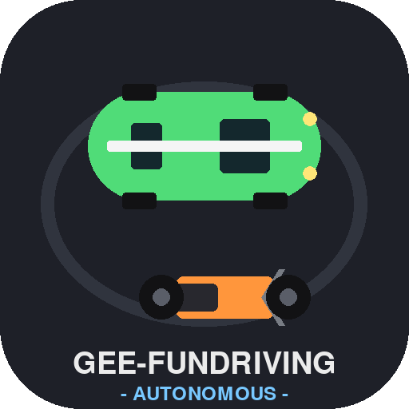
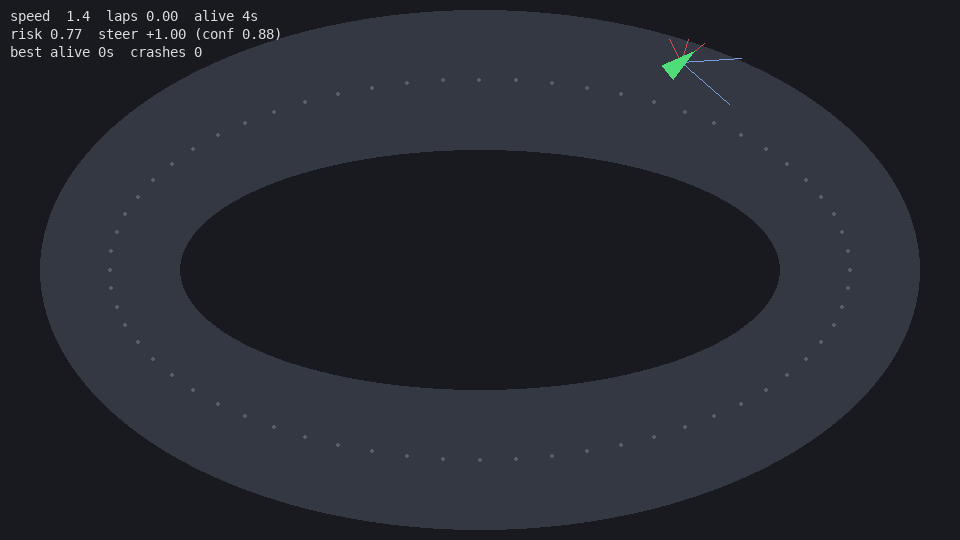

# MiniDrive-Jev 🚗💨

Simulasi nyetir 2D top-down: **1 mobil autonomous** keliling sirkuit dengan *System-One decision loop* — inspirasi dari [demo "rebuilt Tesla FSD with Jev"](https://x.com/jpschroeder/status/2100347770867458384) (TypeSafe AI's Jev model).





## Konsep

Mobil nggak pakai bahasa natural — dia **memutuskan** tiap tick:

| State (sensor) | Keputusan (typed) |
|---|---|
| `f, fl, fr, l, r` — jarak ray 5 arah | `steer ∈ [-1,1]` |
| `lateral` — posisi vs center line | `throttle ∈ [0,1]` |
| `heading_err` — sudut vs arah track | `brake ∈ {0,1}` |
| `speed_norm` | + `confidence` per keputusan |

Fungsi `brain_decide(state)` adalah **pluggable brain**. Default: rule-based yang mengimitasi pola Jev (pertanyaan kecil paralel → keputusan typed + confidence). Ganti dengan API call Jev asli tanpa menyentuh kode lain.

## Hasil tes awal

- 3 lap penuh dalam 30 detik, **0 crash**
- Reset otomatis saat keluar jalan + statistik `best alive`

## Jalanin

```bash
pip install pygame

# Mode jendela (butuh display)
python3 minidrive.py

# Headless + rekam MP4 30 detik
python3 minidrive.py --headless --seconds 30
# → minidrive_demo.mp4
```

## Struktur

```
minidrive.py     # sim + physics + sensors + brain + renderer
docs/demo.png    # screenshot gameplay
```

## Roadmap

- [ ] Mode "sedang": mobil + motor, obstacle acak
- [ ] Multi-agent + leaderboard
- [ ] Hook Jev API asli (early access TypeSafe) sebagai brain
- [ ] Brain generational (evolution) buat belajar hindar

---
Dibuat di D4 oleh bakasang untuk Gee 🏁
