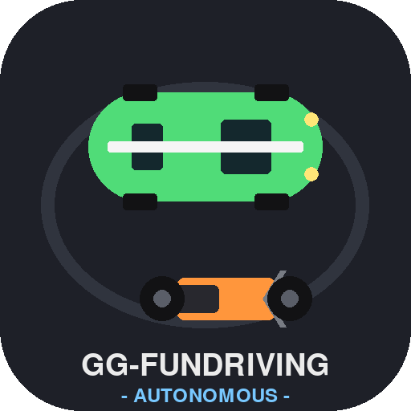
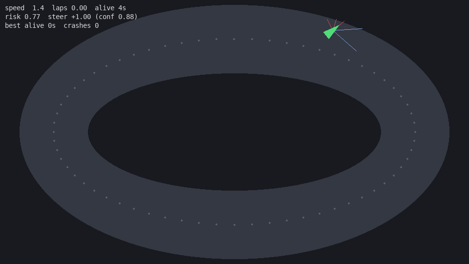

# GG-FunDriving 🚗💨

Simulasi nyetir 2D top-down: **1 mobil autonomous** keliling sirkuit dengan *System-One decision loop* — inspirasi dari [demo "rebuilt Tesla FSD with Jev"](https://x.com/jpschroeder/status/2100347770867458384) (TypeSafe AI's Jev model).





## Versi web 3D (ala JevPilot) — jalan di browser

Port setia ke **Vite + Three.js** dengan UI ala [JevPilot](https://jevpilot.standardagents.ai):
tema terang glassmorphism, **main menu (Mulai / Settings / Tentang)**, settings
tersimpan di `localStorage` (mode otopilot/manual, kecepatan basis 0.5–1.5×,
**tipe kendaraan city car / bus**, peta, otak v4/v3, lalu lintas), **waypoint
ala "add stop"** (klik minimap = rute lewat situ, shift+klik hapus terakhir,
🚩✕ bersihkan), **rambu jalan** (STOP deterministik + zona batas kecepatan 25
km/j — autopilot nurut, HUD LIMIT ikut berubah; langgar STOP = penalti),
**parkiran tepi jalan** (mobil parkir = obstacle; slot kosong = target),
**parkir otonom** (auto-park di tujuan atau tekan `[K]`: servo masuk bay,
goyangan mundur-maju ala parkir beneran — mobil punya gear R — lalu rem
rapat; dialog sampai-tujuan nampilin 🅿️), **ETA ala navigasi** (⏱ di nav card:
integrasi sisa rute vs profil kecepatan + sisa fase merah lampu yang
siklusnya deterministik + dwell STOP `v/2b + v/2a + 0,8s`), navigation card
(belokan berikutnya + sisa jarak), minimap ber-route, driver dock (speed +
LIMIT + tombol otopilot), inspector JSON live 4 Hz (payload planner +
respons), dialog sampai-tujuan & game-over, touch thumbstick, loading screen,
dan dunia siang bermarka lengkap (zebra cross, lampu jalan, bayangan
beneran). Gerakan mobil pakai **model sepeda kinematik** (yaw =
v·tan(delta)/wheelbase, sudut roda di-rate-limit) **+ batas genggam lateral
μg** (lingkaran gesek — understeer realistis saat kebut; di luar aspal μ
0,55) **+ hambatan jalan** (rolling + drag kuadratik — mobil nyelesai sendiri
tanpa gas) — belokan halus dan otomatis ikut skala kendaraan (bus radius
putarnya lebar). Planner jalan di web worker. Live:
**https://gg-fundriving.pages.dev**

Default mode **satu kendaraan** (challenge penyempurnaan mobil hero: lane
keeping, tikungan, lampu merah). Mau mobil AI balik? `?traffic=1`.

```bash
cd webapp
npm install
npm run dev        # http://localhost:5173
npm run build      # dist/ — deploy: npx wrangler pages deploy dist
```

Keys: `[J]` otopilot on/off, `[WASD/panah/space]` manual, `[C]` kamera
Chase/Driver/Top, `[P]`/`[ESC]` pause, `[R]` misi baru, `[K]` parkir otopilot,
`{ }` inspector JSON.
Param URL: `?brain=v3` (brain lama), `?jev=https://...` (hook LLM eksternal),
`?traffic=1`, `?map=/file.json`.
Smoke test headless (Node, tanpa browser): `node tools/benchmark.mjs --brain v4
--seconds 360` (fisika genggam-lat + rambu bikin rata-rata pelan ~15% —
budget 240s lama kekecilan buat misi panjang).

## Loop City (default, peta internal — instan & gampang diadaptasi)

Peta ring kota bikinan sendiri: 1 jalan lingkar + 3 jalan cross (6 simpang
berlampu) + bangunan + taman. Loading instan, semua fitur jalan. Mau diubah-
ubah? Semua parameter ada di atas `tools/make_loopmap.py` (ukuran ring, lebar
jalan, kepadatan bangunan, posisi cross, seed).

```bash
python tools/make_loopmap.py     # regenerate peta (23KB, sekali saja)
python fundriving.py --map loop  # mode misi + traffic + lampu di Loop City
```

## Peta OSM nyata (opsional, berat — fetch sendiri)

Mau dunia kota asli? Fetch dari OpenStreetMap (butuh internet, hasilnya puluhan MB, gak disimpan di repo):

```bash
python tools/fetch_osm.py                          # preset: Puri Indah -> Cengkareng/Taman Palem
python tools/fetch_osm.py --preset puri-indah      # area kecil Puri Indah doang
python tools/fetch_osm.py --bbox -6.19 106.73 -6.15 106.76 --name "Area X" --out maps/x.json

# koordinat bebas + rute antar dua titik (contoh: Green Sedayu -> Puri Indah Mall):
python fundriving.py --map maps/puri_cengkareng.json \
    --route green-sedayu puri-indah
# atau langsung lat,lon:
python fundriving.py --map maps/puri_cengkareng.json \
    --start "-6.1390775,106.7286378" --goal "-6.1882573,106.7338886"

# headless (rekam MP4, butuh ffmpeg):
python fundriving.py --map loop --headless --seconds 60
```

Fitur map mode:
- **Self-driving v4 (default)**: candidate sampling ala [JevPilot](https://github.com/standardagents/jevpilot) — 13 kandidat maneuver (4 target speed × 3 offset lajur + rem) di-rollout 1,5 detik tiap 4 Hz pakai fisika yang sama dgn mobil, di-tag (off-road, kontak AI + timing, nyebrang merah), difilter ala moving set, lalu diskor lokal. Maneuver menang dieksekusi antar keputusan via pure pursuit. Endpoint kandidat + maneuver terpilih kelihatan langsung di peta
- **Brain Jev asli**: isi `TYPESAFE_API_KEY` di `.env` (copy dari `.env.example`, BYOK — file `.env` jangan di-commit) biar Jev SystemOne yang milih kandidat tiap 4 Hz; gagal/time-out otomatis balik ke scorer lokal. Alternatif endpoint custom: `JEV_API_URL` (POST payload tabel kandidat, balas `{"choice": "v3"}`). Varian kedua `--brain jev`: Jev direct-judgment (Choice manuver + Noul darurat, hold 45 frame, butuh `pip install typesafe-sdk`) — bisa sampai tujuan tapi masih kasar (Loop City 709, offroad 59%; OSM belum selesai). HUD nampilin sumber keputusan (`[jev]` / `[lokal]`)
- **Fallback `--brain v3`**: pure pursuit (target selalu di atas rute), progresi proyeksi segmen, raut rute Douglas-Peucker (bunuh zigzag dual-carriageway), antisipasi tikungan (rem curvature, slow-in fast-out), ACC proporsional searah (lawan arah bukan rintangan), anti-stall, safety-net snap kalau keluar > 35m
- **Anti-deadlock dua tier**: breaker lama (gap < 15m, 4 detik) + tier baru (diam total 8 detik apa pun gapnya — standoff lawan arah)
- **Lajur kanan**: mobil jalan di lajur kanan (bukan tengah jalan), AI deteksi mobil lu sebagai rintangan
- **Dunia berlapis**: jalan per-tipe dengan casing, poligon bangunan, area hijau/air — chunk cache per-tile 500m (60fps di peta 9x9 km)
- **Koordinat bisa diatur**: `--route poi-a poi-b` (dari maps/poi.json), atau `--start "lat,lon"` + `--goal "lat,lon"` + `--heading derajat`
- **Mode misi**: skor = rute terpendek ÷ rute ditempuh × 1000, −40/lampu merah, −25/tabrakan; selesai → auto misi baru
- **Lalu lintas**: mobil AI random-walk di graf (lane kanan, jaga jarak, deteksi hero) + lampu lalu lintas siklus 7 detik, nyabrang merah kena denda
- **Nama jalan** di dekat mobil, pathfinding A* di graf OSM
- **Main menu**: `python fundriving.py` tanpa argumen → **START / SETTINGS / ABOUT / API KEY / EXIT** (API KEY buat tempel key TypeSafe langsung dari game — masking, tersimpan di `.env`). SETTINGS ngatur mode (assistant / kendali sendiri), peta (Loop City / sirkuit / OSM kalau ada), dan render FPS 30/60 — tersimpan di `~/gg-fundriving/settings.json`. ESC di game balik ke menu; windowed tanpa `--seconds` = main tanpa timer
- **Bisa dikendarai sendiri**: tekan `F` untuk lepas dari assistant dan kemudikan mobil pakai `WASD`/arrow (`W`/`↑` gas, `S`/`↓` rem, `A`/`D` belok — kemudi di-smooth biar gak jerk). Tekan `F` lagi buat balik ke autopilot. Mulai langsung dari kemudi: `--manual`. Di mode manual kamu yang nyabrang lampu merah (denda tetap masuk) dan nggak ada snap balik ke rute
- **Kamera follow** + zoom `[-][=]`, `R` misi baru, `F` assistant ON/OFF, `ESC` keluar, FPS live di HUD; render 30fps (fisika tetap 60Hz), rekaman MP4 headless 30fps real-time

Benchmark learning curve: `python tools/benchmark.py` (dua arah Green Sedayu ↔ Puri Indah di peta OSM, atau misi acak di Loop City; pilih brain dengan `--brain v4|v3`) — hasil tercatat di `docs/benchmark/history.jsonl`. Varian Jev: isi `TYPESAFE_API_KEY` dulu lalu jalanin perintah yang sama — run Jev tercatat sebagai `v4-planner-jev`, tanpa key tercatat `v4-planner` (scorer lokal), `--brain jev` tercatat `jev-direct`.

Terakhir (2026-09-18, peta OSM dua arah): v4 selesai dua-duanya, skor 1003 & 962, 0 tabrak — setara v3 (1005 & 962) dengan offroad lebih bersih di arah pertama (2.1% vs 4.0%).

Terakhir (2026-10-01, OSM dua arah): v4-jev imbang v4-lokal (1003 & 962, 0 tabrak), offroad lebih bersih di arah pertama (1.0% vs 2.1%). Jev terbukti nyetir beneran: trayeknya beda dari run lokal yang deterministik. Latensi Jev ~0.4 dtk/putusan (di atas budget 4 Hz) — oke buat headless/benchmark, tapi butuh planner async biar mulus di mode windowed.

Tambah peta daerah lain: ubah koordinat bbox di `tools/fetch_osm.py` atau pakai `--bbox`.

## Konsep

Mobil nggak pakai bahasa natural — dia **memutuskan** tiap tick:

| State (sensor) | Keputusan (typed) |
|---|---|
| `f, fl, fr, l, r` — jarak ray 5 arah | `steer ∈ [-1,1]` |
| `lateral` — posisi vs center line | `throttle ∈ [0,1]` |
| `heading_err` — sudut vs arah track | `brake ∈ {0,1}` |
| `speed_norm` | + `confidence` per keputusan |

Fungsi `brain_decide(state)` adalah **pluggable brain**. Default: rule-based yang mengimitasi pola Jev (pertanyaan kecil paralel → keputusan typed + confidence). Ganti dengan API call Jev asli tanpa menyentuh kode lain.

## Hasil tes awal

- 3 lap penuh dalam 30 detik, **0 crash**
- Reset otomatis saat keluar jalan + statistik `best alive`

## Jalanin

```bash
pip install pygame

# Mode jendela (butuh display)
python3 fundriving.py

# Headless + rekam MP4 30 detik
python3 fundriving.py --headless --seconds 30
# → fundriving_demo.mp4
```

## Struktur

```
fundriving.py     # sim + physics + sensors + brain + renderer
docs/demo.png    # screenshot gameplay
```

- [x] Map mode: peta jalan asli OSM (Puri Indah) — DONE

## Roadmap

- [ ] Mode sedang: mobil + motor, obstacle acak, traffic
- [ ] Multi-agent + leaderboard
- [x] Brain Jev asli (desktop): `TYPESAFE_API_KEY` via env/`.env` (payload tabel kandidat ala JevPilot, fallback lokal otomatis)
- [ ] Brain Jev asli (web): kolom key di Settings — saat ini web cuma support `?jev=` endpoint custom
- [x] Port web 3D ala JevPilot: Vite + Three.js, worker planner, deploy Cloudflare Pages
- [ ] Brain generational (evolution) buat belajar hindar

## Referensi

- [JevPilot](https://github.com/standardagents/jevpilot) ([demo online](https://jevpilot.standardagents.ai)) — demo Tesla FSD ala Jev yang open source; arsitektur candidate sampling + pemilihan model jadi dasar brain v4, dan port web 3D kami ngikutin gaya demo-nya

---
Dibuat di D4 oleh bakasang untuk Gee 🏁
